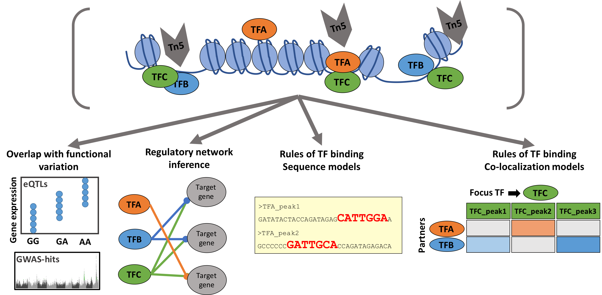

# README #
This repository includes data and code to generate the figures
for the paper ""

The R_notebook folder includes text in line with main and supplementary
figures and the Data folder includes supplementary tables

### Systems view of gene regulation in the maize leaf ###

### Summary ###
Integration of 104 ChIP-seq experiments highlights TF binding redundancy and modularity as key properties of the regulatory network

### Abstract ###
* Transcription factors (TF) mediate the information flow from genotype to phenotype, yet cost effective in-vivo profiling of TF-DNA binding remained prohibitive. With a new scalable ChIP-seq approach, we annotated the regulatory landscape of the maize genome with binding data from 104 leaf expressed TFs   
* TF binding regions co-localized with open chromatin regions, with 70% of TF binding within 2.5kb of genes, but distal binding over 20kb was frequently observed
* Consistent with functional relevance, binding sites showed enrichment for GWAS-hits, cis-expression QTLs, and sequence conservation   
* Furthermore, the regulatory network shows a “scale-free” topology and modularity larger than random graphs, as typical “real world” networks  
* Finally, machine learning analyses found; redundancy in sequence recognition within families, often similar to Arabidopsis TF motifs, and TF binding co-localization as a key predictive feature of TF binding specificity  
* The TF-DNA regions and models derived from maize provide a detailed view of how monocot and plant leaves are regulated

### Who do I talk to? ###
* Maria Katherine Mejia-Guerra (mm2842@cornell.edu)

Copy from this repository in BitBucket 
